<!--
EXAMPLE STRUCUTRE OF A PROJECT README. YOU DON'T NEED TO USE THIS ONE FR FR
-->

# Fred's Fridge

**Team Members:** `Abhiram Yammanuru, Sarayu Vjiayanagaram`

## 💬 Elevator Pitch

`Fred's Fridge is a cozy virtual fridge for families to connect!"`

## Inspiration

`Family-oriented Fred is at a stage where staying organized and connected with his loved ones matters more than ever. But with busy schedules, grocery lists on scraps of paper, and family updates scattered across group chats, it’s easy for things to slip through the cracks. One of the central locations at home for many families is their refrigerator.` 

`Each family's fridge is personal and intimate with memories all over it. Your family's highest moments get highlighted on this fridge.` 

`Fred's Fridge takes that shared space and digitizes it, providing a platform for families to be more interconnected. The main problem that this solves for Fred is a way for him to stay connected to his family, in a way that is very homey.`

## What It Does

- **Shopping List:** `The shopping list is a part of the fridge in which a user can add an item to it, and can click on that specific item to run a strikethrough through it. This is similar to reminders, but geared towards shopping needs.`

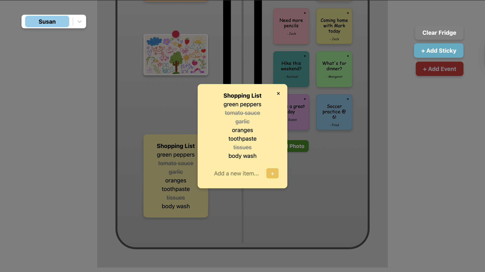
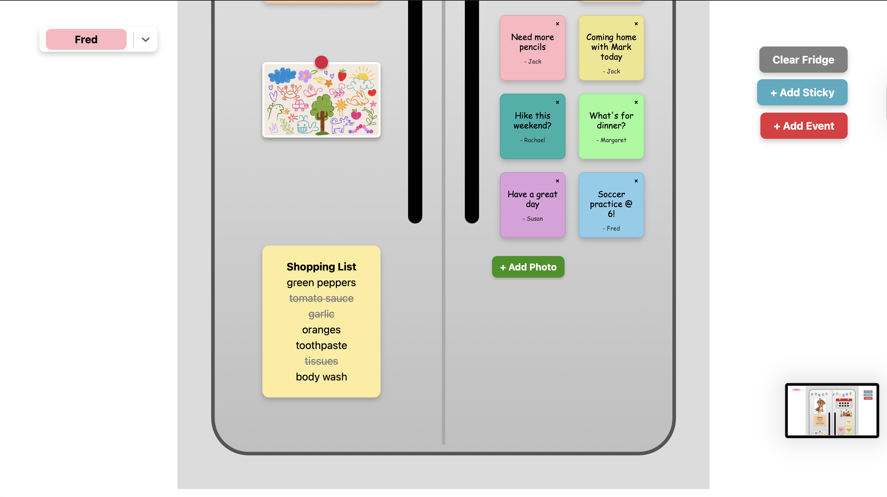

- **Reminders:** `Reminders is a part of the fridge in which a user can add a reminder to a list of reminders, and can click on it to run a strikethrough through it. This is similar to shopping list, but catered towards general reminders and to-dos.`

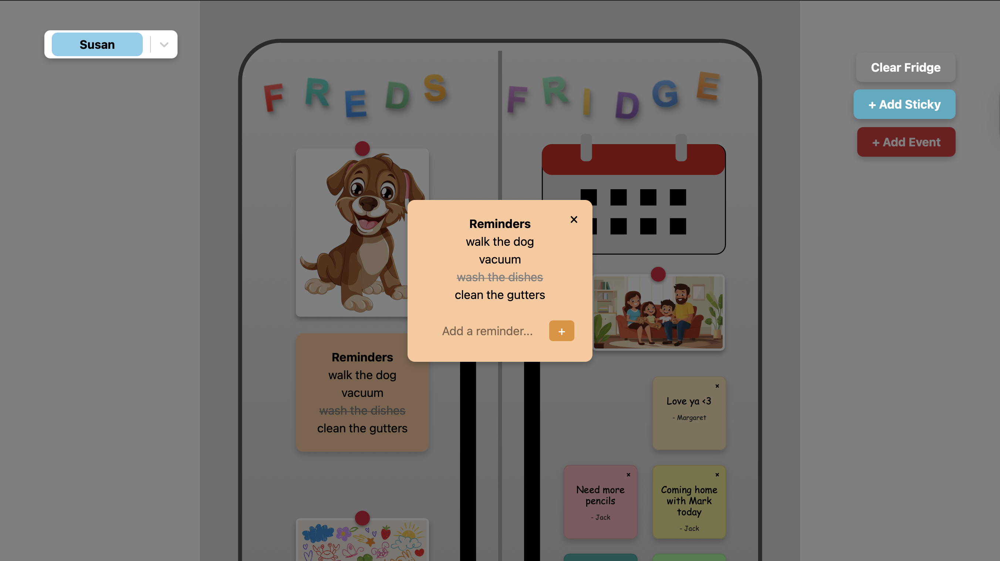  
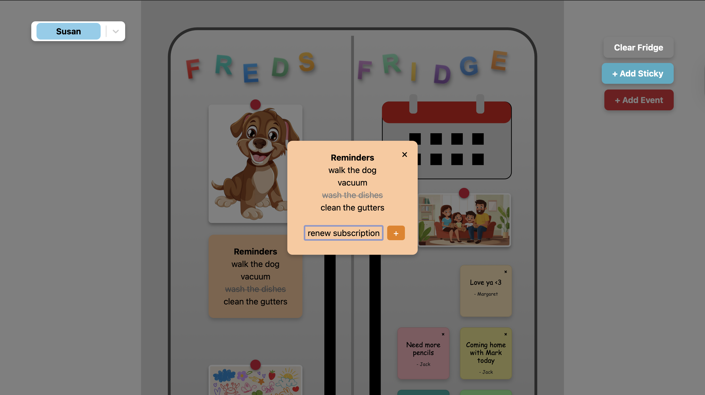  

- **Shared Calendar:** `The shared calendar is a way for different members of the family to create events, and assign those events to specific people. Everyone will be able to see the events, and this creates a unified space for all upcoming events.`

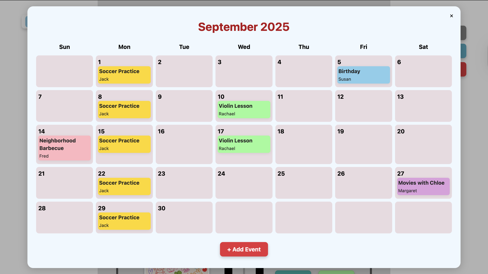  
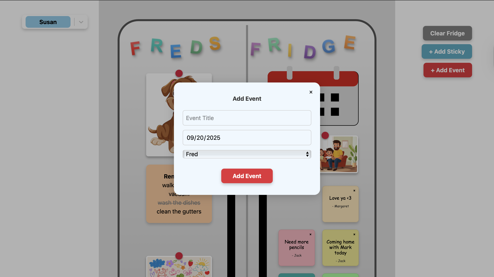  

- **Sticky Notes:** `Sticky notes have their own button, in which a user can add text and add a virtual sticky note to the fridge. These stickies can be colored, and states which user created it.`

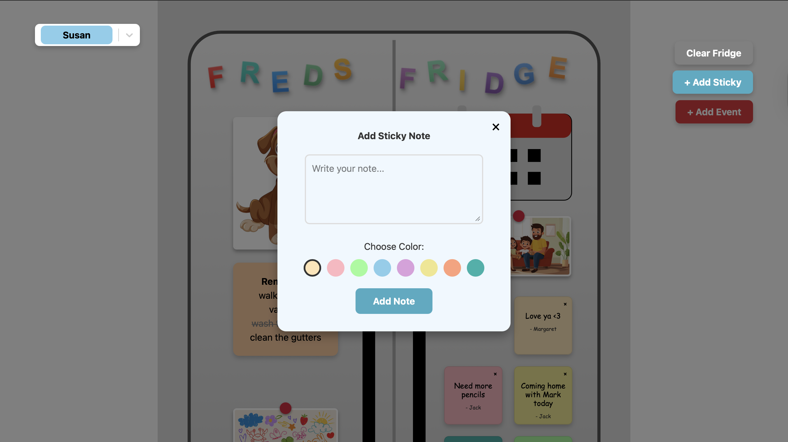  

- **Photos:** `Photos have their own button in which a user can add their own images to personalize the family's fridge.`

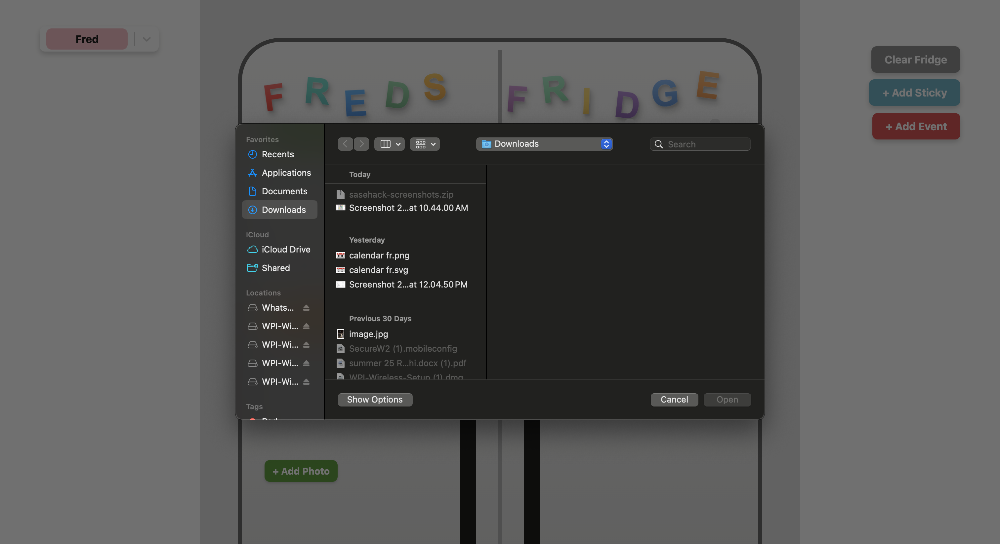  

- **Users:** `You are able to assign events to Users and are able to switch users. This involves having their own sticky notes, as well as creating and viewing events on the shared calendar.`

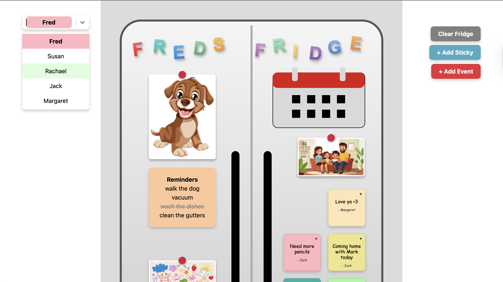  

- **Clear Fridge:** `This button can clear the entire fridge`

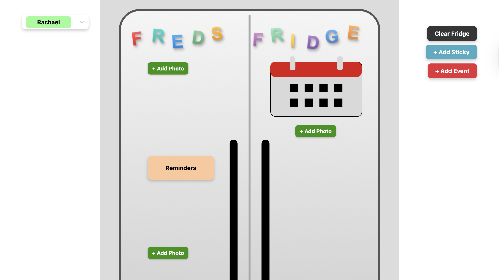
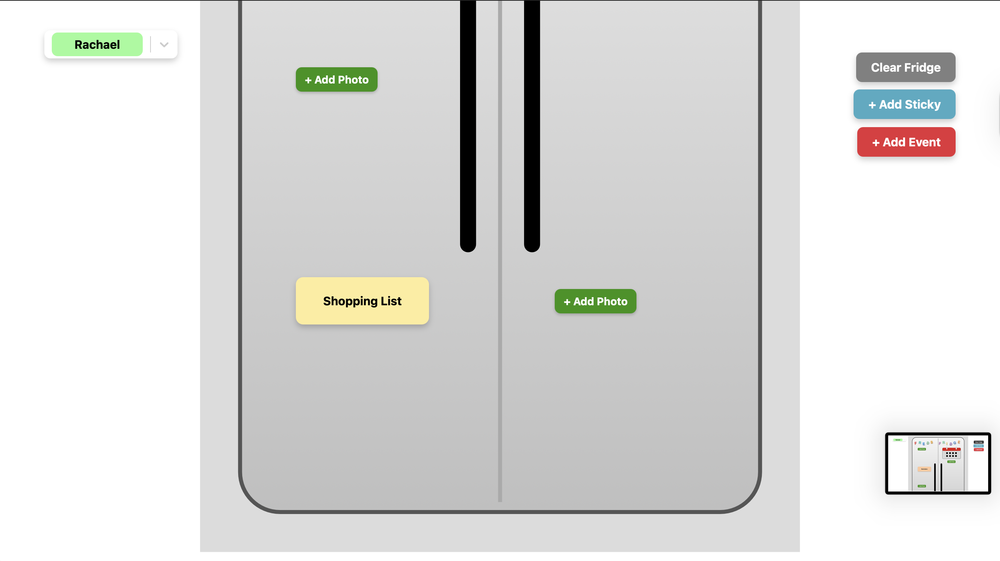

## How We Built It

- **Frontend:** `React, Vite, JavaScript, CSS, SVG Assets`

- **Backend:** `Python, Flask`

## Challenges We Ran Into

`The first challenge that we ran into was narrowing down our scope and vision. We had a lot of ideas, but with the time frame it became a bit too ambitious. We decided to pivot and make sure that the features we delivered were functional. Secondly, we had limited experience with React, so the learning curve was challenging. The biggest challenge that we ran into was local storage. We wanted there to be a way in which we could reload the page and have specific items (such as sticky notes and photos) to stay and not be refreshed. `

## Accomplishments We're Proud Of

`We are most proud of the UI for the photos. Not only do they import without many issues, they have a cute red "magnet" at the top which gives it a more realistic view. It's a very small thing, but we feel like it really puts things together. It also creates a small border for each of the photos, further making them look more realistic and cuter.`

## What We Learned

`As mentioned in our challenges section, we learned about local storage, which was something that we didn't have experience with before. Additionally, we gained a lot more experience experimenting with UI and React components.`

## What's Next for

$$
Fred's Fridge
$$

`One of the biggest things we were trying to implement (but didn't have time), was drag and drop functionality. This would have been something that could've completely revamped the personalization of Fred's Fridge, and would have made it more unique and tailored. This would have been the direction that we would have taken the project in.`

## Getting Started

To get a local copy up and running, follow these simple steps.

### Prerequisites

- You will need `Node.js, npm, python, and flask` installed on your machine.

### Installation

1. Clone the repo

`git clone https://github.com/sarayuv/sasehack-2025.git`

2. Navigate to the backend

`cd backend`

3. Create a virtual environment:
   
`python3 -m venv venv`

4. Activate the virtual environment:
   - On macOS and Linux:
     
    `source venv/bin/activate`
     
   - On Windows:
     
    `.\venv\Scripts\activate`

5. Install dependencies

`pip install -r requirements.txt`

6. Run the backend (this will load the backend)

`python app.py` 

7. Navigate to the frontend

`cd ..`
`cd frontend`

7. Install Dependencies
   
   `npm install`

8. Launch Development Server

`npm run dev`

9. Navigate to the localhost URL

It should say in terminal
   

## 🔗 Important Links

- **Devpost Submission:** `[Link to your Devpost project page]`

- **Live Demo:** `[Link to your deployed project (if applicable)]`

## Credits for Stock Images
`Family Picture:` https://static.vecteezy.com/system/resources/thumbnails/050/670/089/small_2x/a-family-enjoying-a-playful-afternoon-at-home-with-stuffed-animals-in-a-cozy-living-room-setting-photo.jpg
`Kid's Drawing:` https://img.freepik.com/free-vector/crayon-kid-drawings-colorful-childlike-doodles_107791-34497.jpg?semt=ais_incoming&w=740&q=80
`Pet:` https://img.freepik.com/free-vector/happy-cartoon-puppy-illustration_1308-166286.jpg?semt=ais_incoming&w=740&q=80