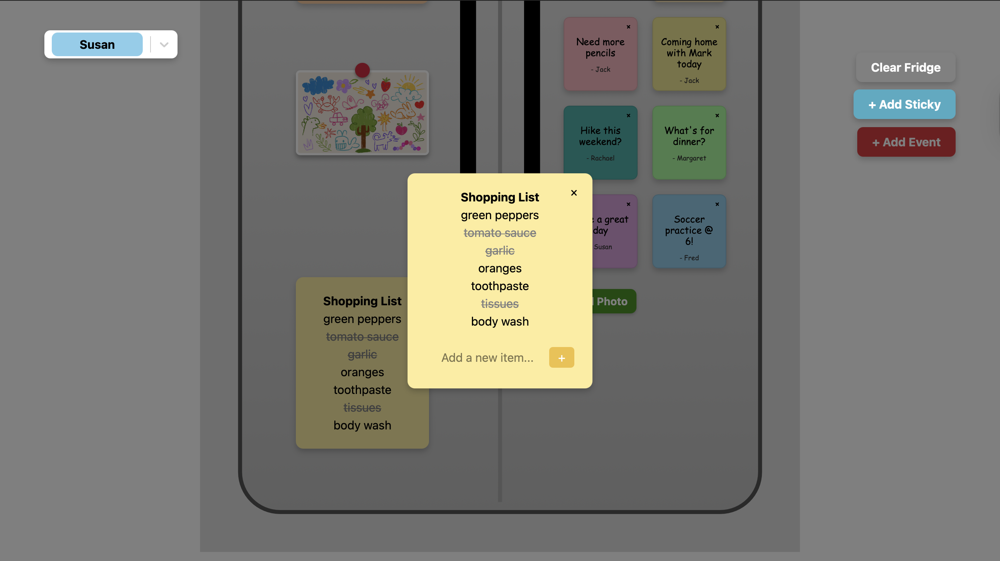
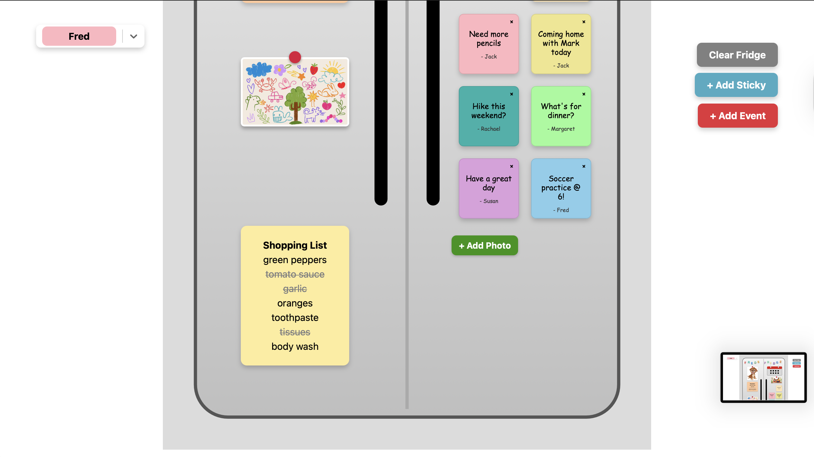
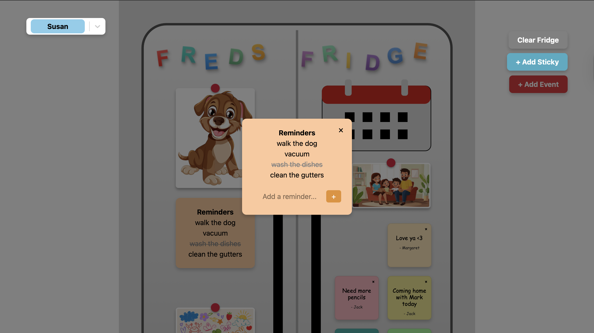
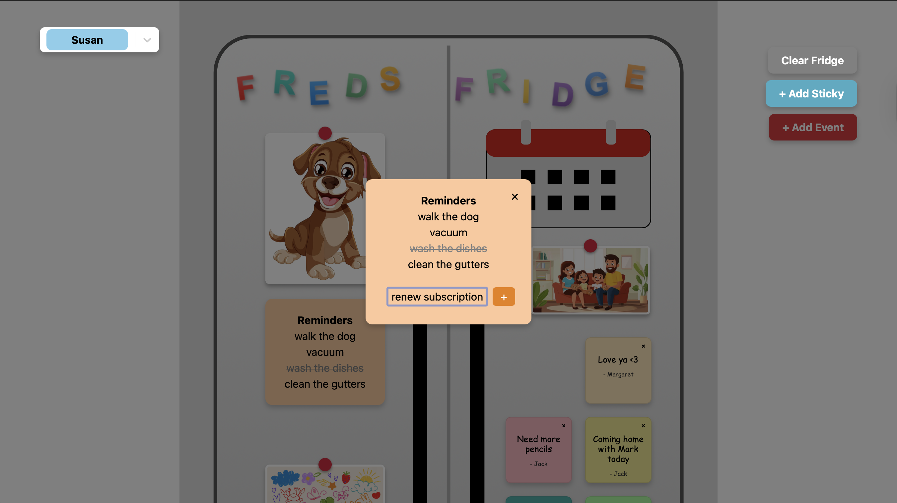
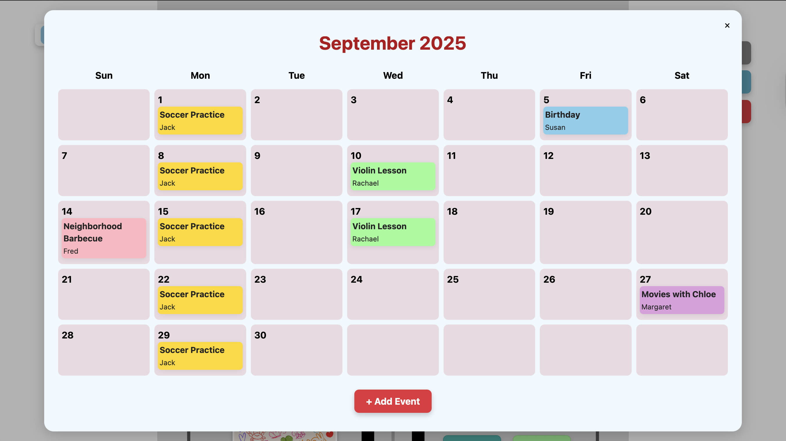
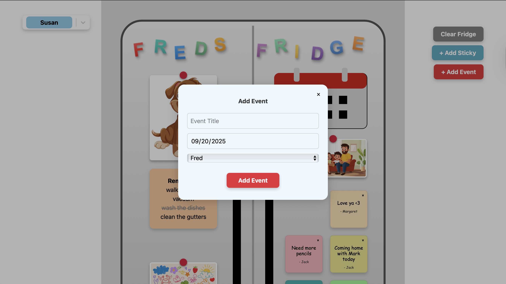
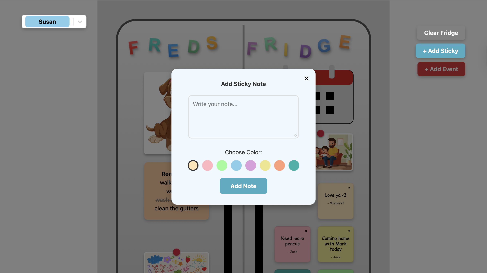
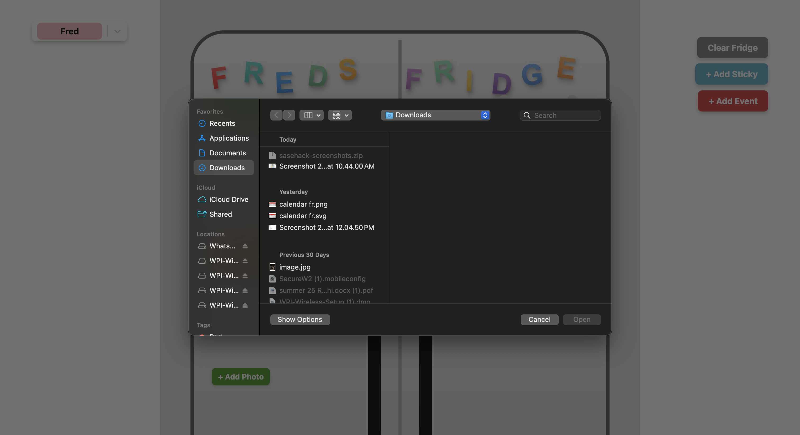
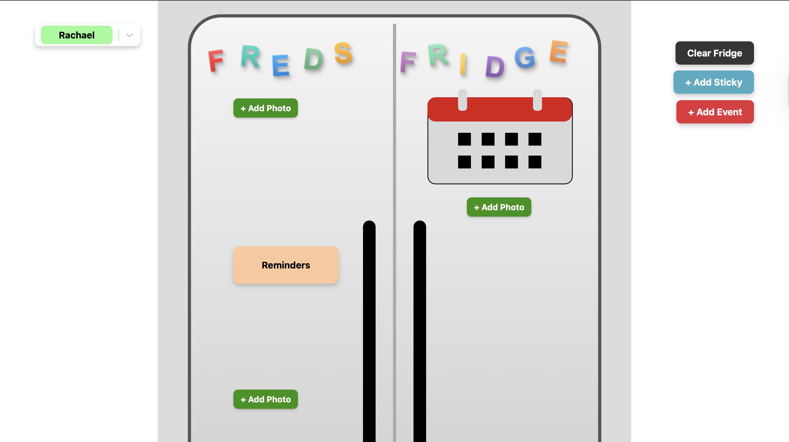
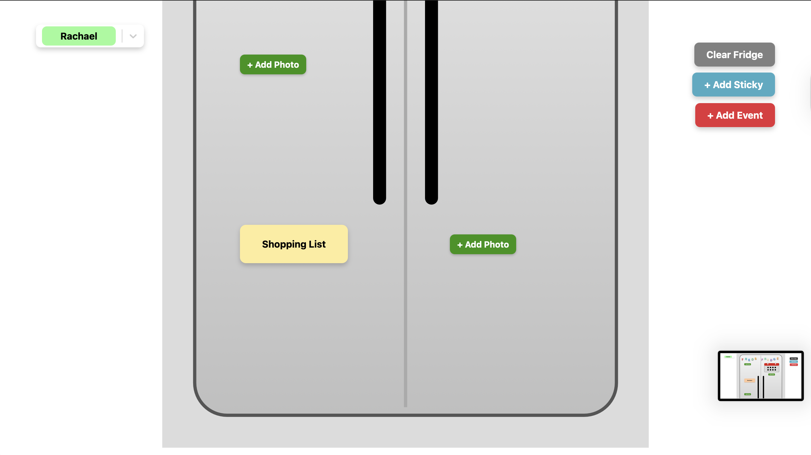

# Fred's Fridge

**Team Members:** `Abhiram Yammanuru, Sarayu Vijayanagaram`

## 💬 Elevator Pitch

`Fred's Fridge is a cozy virtual fridge for families to connect.`

## Inspiration

`Family-oriented Fred is at a stage where staying organized and connected with his loved ones matters more than ever. But with busy schedules, grocery lists on scraps of paper, and family updates scattered across group chats, it’s easy for things to slip through the cracks. One of the central locations at home for many families is their refrigerator.` 

`Each family's fridge is personal and intimate with memories all over it. Your family's highest moments get highlighted on this fridge.` 

`Fred's Fridge takes that shared space and digitizes it, providing a platform for families to be more interconnected. The main problem that this solves for Fred is a way for him to stay connected to his family, in a way that is very homey.`

## What It Does

- **Shopping List:** `The shopping list is a component that helps families keep track of groceries and essentials. Users can add new items, and once something is purchased, clicking on it strikes it out.`

- **Reminders:** `Reminders is a component for keeping track of tasks and to-dos. Users can add reminders to the list, and once completed, click to strike them out. This is similar to the shopping list, but focused on general household reminders and daily tasks.`

  
  

- **Shared Calendar:** `The shared calendar is a component that allows family members to create and assign event to specific people. Everyone can view upcoming events, creating a unified space to keep the whole family organized and in sync.`

  
  

- **Sticky Notes:** `Sticky notes are a feature that lets users add virtual sticky notes to the fridge. Notes can include text, be color-coded, and display which family member created them, adding a personal and organized touch to the space.`

  

- **Photos:** `Photos are a feature that allows users to upload and display their own images on the virtual fridge. This helps families share memories and make the spcae feel more lively and connected.`

  

- **Users:** `This feature allows family members to have their own profiles. Each user can create and view events on the shared calendar, and add personalized sticky notes, keeping everyone organized and connected.`

  

- **Clear Fridge:** `This button lets users clear all items from the virtual fridge, providing a quick way to start fresh for the week.`

## How We Built It

- **Frontend:** `React, Vite, JavaScript, CSS, SVG Assets`

- **Backend:** `Python, Flask`

## Challenges We Ran Into

`The first challenge that we ran into was narrowing down our scope and vision. We had a lot of ideas, but with the time frame it became a bit too ambitious. We decided to pivot and make sure that the features we delivered were functional. Secondly, we had limited experience with React, so the learning curve was challenging. The biggest challenge that we ran into was local storage. We wanted there to be a way in which we could reload the page and have specific items (such as sticky notes and photos) to stay and not be refreshed. `

## Accomplishments We're Proud Of

`We are most proud of the UI design, which is clean, family-friendly, and easy to navigate. The photo board stands out with cute red magnets and borders that give the fridge a realistic and playful feel. Throughout the project, we also grew more confident with React, building interactive features such as sticky notes, shopping lists, and the photo board.`

## What We Learned

`As mentioned in our challenges, we learned how to use local storage, a feature we limited experience with, which allowed us to make notes and photos persist between sessions. We also gained valuable experience experimenting with UI design and React components, improving both the functionality and user experience of our website.`

## What's Next for Fred's Fridge

`One of the biggest features we hoped to implement was drag-and-drop functionality, which would allow users to easily move and rearrange fridge items, making Fred's Fridge more personalized and interactive. In the future, we also plan to add user-specific views, giving each family member a personalized space on the fridge. Additionally, we want to introduce reactions, so users can respond to notes and photos with fun emojis, further enhancing family interaction and engagement.`

## Getting Started

To get a local copy up and running, follow these simple steps.

### Prerequisites

- You will need `Node.js, npm, python, and flask` installed on your machine.

### Installation

1. Clone the repo

`git clone https://github.com/sarayuv/sasehack-2025.git`

2. Navigate to the backend

`cd backend`

3. Create a virtual environment:
   
`python3 -m venv venv`

4. Activate the virtual environment:
   - On macOS and Linux:
     
    `source venv/bin/activate`
     
   - On Windows:
     
    `.\venv\Scripts\activate`

5. Install dependencies

`pip install -r requirements.txt`

6. Run the backend (this will load the backend)

`python app.py` 

7. Navigate to the frontend

`cd ..`
`cd frontend`

7. Install Dependencies
   
   `npm install`

8. Launch Development Server

`npm run dev`

9. Navigate to the localhost URL

It should say in terminal
   

## 🔗 Important Links

- **Devpost Submission:** `[Link to your Devpost project page]`

- **Live Demo:** `[Link to your deployed project (if applicable)]`

## Credits for Stock Images
`Family Picture:` https://static.vecteezy.com/system/resources/thumbnails/050/670/089/small_2x/a-family-enjoying-a-playful-afternoon-at-home-with-stuffed-animals-in-a-cozy-living-room-setting-photo.jpg
`Kid's Drawing:` https://img.freepik.com/free-vector/crayon-kid-drawings-colorful-childlike-doodles_107791-34497.jpg?semt=ais_incoming&w=740&q=80
`Pet:` https://img.freepik.com/free-vector/happy-cartoon-puppy-illustration_1308-166286.jpg?semt=ais_incoming&w=740&q=80